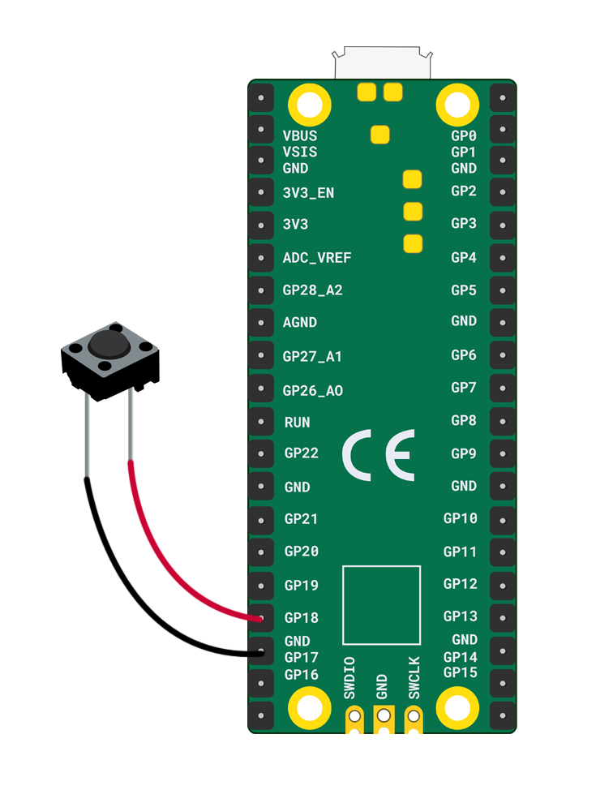

You will need:

+ A Raspberry Pi Pico
+ 2 x socket-socket jumper wires
+ 1 x push button

To connect your push button:

+ Attach the two jumper wires to the push button pins (secure with tape if needed)
+ Connect one jumper wire to the **GP18** pin
+ Connect the other jumper wire to the closest **GND** pin

**Note:** There are no positive or negative legs here so it doesn't matter which way round you connect the wires. 

