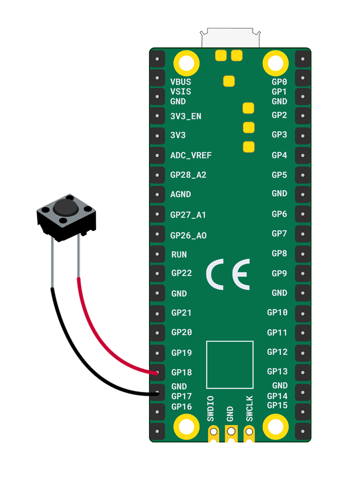

Tu auras besoin de :

+ Un Raspberry Pi Pico
+ 2 x fils de liaison prise-prise
+ 1 x bouton poussoir

Pour connecter ton bouton poussoir :

+ Attacher les deux fils de liaison aux broches du bouton poussoir (fixer avec du ruban adhésif si nécessaire)
+ Connecter un fil de liaison à la broche **GP18**
+ Connecter l'autre fil de liaison à la broche **GND** la plus proche

**Remarque :** Il n'y a pas de pattes positives ou négatives ici, donc peu importe le sens dans lequel tu connectes les fils.

